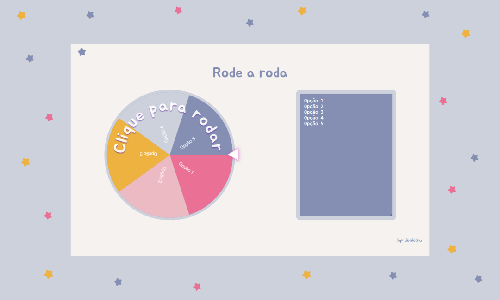

# Spin the Wheel 🎡
O Spin the Wheel (Rode a roda) é um website interativo que permite aos usuários inserir várias opções e sortear uma delas de forma aleatória. Ideal para fazer sorteios! Acesse clicando [aqui](https://junicola.github.io/wheel/).

## 💻 Tecnologias Utilizadas
HTML: Estruturação da página.

CSS: Estilização e design responsivo.

JavaScript: Lógica de funcionamento e interatividade.

## 🌟 Funcionalidades
Inserção de múltiplas opções: Adicione quantas opções desejar.

Sorteio aleatório: Gire a roda e descubra a opção sorteada.

## 📸 Screenshot

## 📄 Licença
Este projeto está sob a licença MIT. Veja o arquivo LICENSE para mais detalhes.